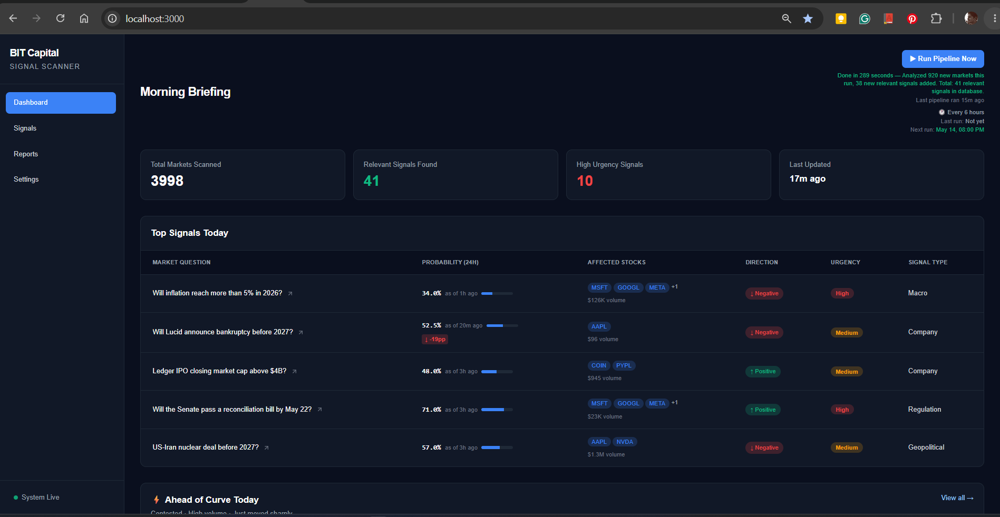
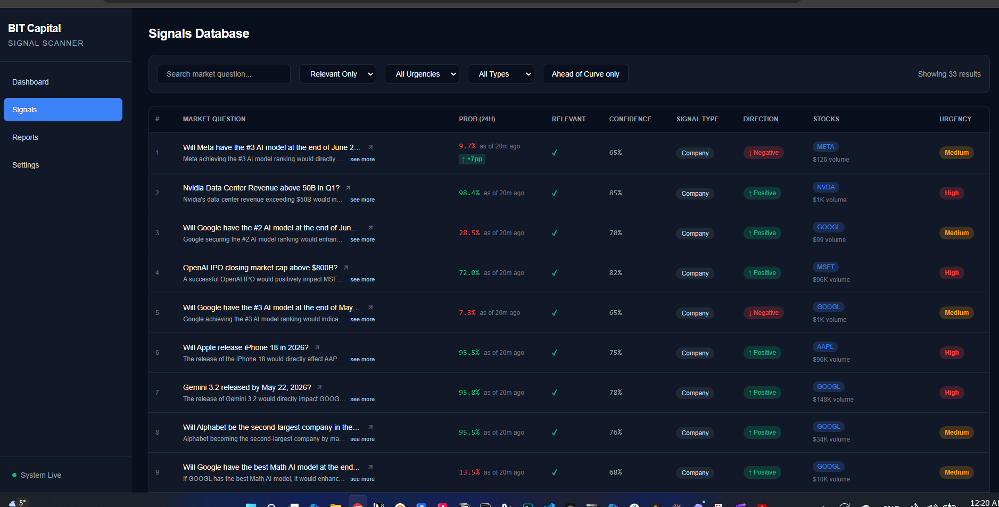

# BIT Capital Signal Scanner

> AI-powered prediction market scanner that filters Polymarket signals relevant to tech equities and generates analyst-grade morning briefings using LLMs.

Built as a technical case study for the **AI Engineering Intern** position at [BIT Capital](https://bitcap.com), a Berlin-based asset manager focused on global technology leaders.

---

## 📺 Live demo

Watch a 3-minute walkthrough of the working app:
**[Loom Demo](https://www.loom.com/share/bdc8cd2fe30b4c3388d72b74ef287517)**

---

## What it does

Polymarket hosts thousands of prediction markets every day — Fed decisions, tariffs, AI regulation, company milestones, sports, celebrity news, weather. **Most are noise.** A small fraction contain real signals for equity investors.

This scanner:

1. **Ingests** ~1,200 markets per pipeline run from Polymarket every 6 hours
2. **Filters** them using an LLM grounded in BIT Capital's actual portfolio holdings (sourced from public 13F filings)
3. **Classifies** relevant signals by urgency, direction, signal type, and thematic exposure
4. **Generates** structured morning briefings styled as analyst notes
5. **Surfaces** everything through a dark-mode dashboard built for finance professionals

The goal: turn ~1,200 markets per pipeline run into a 5-minute morning read with the **3 signals an analyst should act on today**.

---

## Screenshots

### Dashboard — Morning briefing at a glance



The Dashboard surfaces the day's top signals with affected BIT Capital tickers, direction (positive/negative), urgency level, and signal type. Each card is one click away from the source Polymarket market.

### Signals Database — Queryable, filterable



The full database of analyzed markets. Analysts can filter by urgency, signal type, direction, or Ahead of Curve flag. Each signal includes its LLM-generated reasoning, affected stocks, and a direct link back to the source market.

### Morning Briefing — Analyst-grade output


The auto-generated morning briefing, structured like a sell-side research note: Market Pulse, Top 3 Signals to Act On (with portfolio impact and conviction levels), Portfolio Exposure Summary, Contrarian Take, What to Watch Today, and Risk to This View. One-click PDF export.

---

## Architecture

```
┌─────────────────┐
│  Polymarket API │  (public, no auth)
└────────┬────────┘
         │ fetch every 6 hours
         ▼
┌──────────────────────┐
│  Ingestion Pipeline  │  src/lib/polymarket.ts
└────────┬─────────────┘
         │ upsert
         ▼
┌──────────────────────┐
│  Supabase (Postgres) │  markets, signals, reports, config
└────────┬─────────────┘
         │ query unanalyzed
         ▼
┌──────────────────────────┐
│  SQL pre-filter          │  WHERE probability BETWEEN 0.15 AND 0.85
│  (informational edge)    │  candidates ranked by theme score + volume
└────────┬─────────────────┘
         │ top 100 candidates
         ▼
┌──────────────────────────┐
│  LLM Extractor           │  src/lib/filter.ts (OpenAI GPT-4o-mini)
│  - 10 batches in parallel│  Job: name tickers, signal type, direction,
│  - JSON output           │       confidence — NOT decide relevance
│  - Permissive extraction │  ~15s total wall time
└────────┬─────────────────┘
         │ structured extraction
         ▼
┌──────────────────────────┐
│  Code Judge              │  validateAndClean()
│  (the relevance decision)│  Sets is_relevant ONLY if all gates pass:
│                          │   1. ≥1 BIT Capital ticker
│                          │   2. probability 15–85%
│                          │   3. expiry > 24h
│                          │   4. not a price-target market
│                          │   5. confidence ≥ 0.45
└────────┬─────────────────┘
         │ stores structured signals
         ▼
┌──────────────────────┐
│  Report Generator    │  src/lib/reports.ts
│  - Morning briefing  │
│  - Top 3 to act on   │
│  - Contrarian take   │
└────────┬─────────────┘
         │ rendered in
         ▼
┌──────────────────────┐
│  Next.js Frontend    │  Dashboard, Signals, Reports, Settings
└──────────────────────┘
```

### Tech stack

- **Frontend:** Next.js 14, TypeScript, Tailwind CSS
- **Backend:** Next.js API routes
- **Database:** Supabase (PostgreSQL)
- **LLM:** OpenAI GPT-4o-mini
- **Scheduler:** node-cron (every 6 hours, configurable via UI)
- **PDF generation:** jsPDF
- **Hosting:** Designed to run locally; deployable to Vercel

---

## Why this approach

### 1. Filtering is grounded in real BIT Capital holdings

The LLM filter doesn't use generic tech tickers. It uses a curated list of **23 tickers** derived from BIT Capital's public fund holdings (BIT Global Technology Leaders, etc.) — NVIDIA, ASML, TSMC, Microsoft, Meta, and so on.

This means a market about "EU antitrust action against Apple" gets classified as **directly relevant to AAPL**, while a market about "Will Bitcoin reach $120k?" gets correctly rejected as a pure crypto price target with no BIT Capital exposure.

The prompt explicitly grounds the model: *"You are a senior research analyst at BIT Capital. Here are the only tickers you may use: NVDA, MSFT, GOOGL, META, AAPL, AMZN, AMD, ASML, TSM..."* — and names the exact rejection categories.

This single design choice eliminates most of the noise that a generic "is this finance-related?" filter would let through.

### 2. Structured output, not free text

Every filtered market produces a strict JSON object:

```json
{
  "is_relevant": true,
  "confidence": 0.84,
  "reason": "Direct read on TSMC's Arizona expansion timeline, which BIT Capital portfolio companies depend on for advanced node supply.",
  "affected_stocks": ["TSM", "NVDA", "AMD"],
  "signal_type": "supply_chain",
  "signal_direction": "negative",
  "urgency": "medium",
  "thematic_buckets": ["semiconductors", "geopolitics"],
  "is_ahead_of_curve": false
}
```

This is queryable, sortable, and aggregatable. The UI doesn't have to parse natural language — it just renders structured fields. An analyst can filter by urgency, ticker, or signal type in one click.

### 3. LLM as extractor, code as judge

The earliest version of this filter used the LLM as the gatekeeper — it decided `is_relevant` and the code only checked its work. That approach produced a ~1% hit rate on real Polymarket data, with gpt-4o-mini frequently contradicting itself: naming a BIT Capital ticker as affected, writing valid reasoning, then setting `is_relevant=false` with `confidence=0`. The model was systematically over-cautious on borderline-good signals.

The current architecture inverts this. The LLM is now an **extractor**, not a judge:

**LLM job (in `filter.ts`):**
- Read the market question + description
- Name the BIT Capital holdings affected (be permissive — name them generously)
- Tag signal type, direction, urgency
- Self-rate confidence in the read-through

**Code job (in `validateAndClean()`):**
- Decide `is_relevant` based on the LLM's structured output, using deterministic gates:
  1. **Ticker whitelist** — at least one extracted ticker must be in the 23-holding BIT Capital list
  2. **Probability gate** — market probability must sit in the **15–85% informational edge window**
  3. **Expiry gate** — market must not resolve within 24 hours (no actionable window)
  4. **Price-target gate** — market must not be a direct equity price target ("Will NVDA hit $250?")
  5. **Confidence floor** — LLM's self-rated confidence must be ≥ 0.45

If all five gates pass, the signal is marked relevant **regardless of what the LLM thought** about its own output. This sidesteps the gpt-4o-mini self-contradiction problem entirely — the LLM only has to do the parts it's good at (extraction), and the code does the parts it can do deterministically (rule checking).

A SQL-layer pre-filter ensures only markets in the 15–85% probability window are even considered candidates — saving roughly two-thirds of the API spend that would otherwise be burned on markets the code gate will reject anyway.

Every rejected market is logged with the specific gate that caught it, making the system fully diagnosable from server logs.

### 4. The "ahead of curve" flag — computed in code, not by the LLM

A signal is only valuable if the market doesn't already know about it. The filter checks for markets where:
- Probability sits between **25–75%** (genuinely contested, not near-consensus)
- Volume > $50K (real money, not a thin market)
- Probability has moved recently (the market is updating its view)

These get flagged as **"ahead of curve"** — the window where the prediction market is pricing something in but the equity market hasn't caught up yet.

The `is_ahead_of_curve` flag was originally set by the LLM based on its reasoning. This caused two problems: the LLM often lacked access to the prior-probability data needed to compute the 15pp movement criterion, and its judgment of "contested" was inconsistent run-to-run. The flag is now computed deterministically in TypeScript after the LLM call:

- `market.probability` must be between 0.25 and 0.75
- `market.volume` must exceed $50,000
- `abs(market.probability - market.probability_24h_ago)` must exceed 0.15

This is a deliberate architecture choice: use the LLM for subjective relevance judgment, use code for objective criteria. The result is reproducible, auditable, and testable.

### 5. Reports are written like analyst notes, not chatbot summaries

The report generator uses a separate LLM call with a prompt that explicitly mimics a sell-side analyst tone: short paragraphs, named tickers, explicit direction, contrarian section at the end. Output is rendered as Markdown and exportable as PDF.

---

## Setup

### 1. Clone the repo

```bash
git clone https://github.com/AmrEmara911/Polymarket-signal-scanner-.git
cd Polymarket-signal-scanner-
npm install
```

### 2. Set up Supabase

1. Create a free project at [supabase.com](https://supabase.com)
2. Open the SQL editor and run `supabase/schema.sql` to create the tables
3. Optionally, run `supabase/sample_data.sql` to pre-populate 30 pre-analyzed demo signals so you can explore the full UI immediately without waiting for pipeline runs to accumulate data

### 3. Configure environment variables

Copy the example file:

```bash
cp .env.example .env.local
```

Fill in your credentials in `.env.local`:

```
NEXT_PUBLIC_SUPABASE_URL=https://your-project.supabase.co
NEXT_PUBLIC_SUPABASE_ANON_KEY=your_anon_key
OPENAI_API_KEY=sk-...
```

Find Supabase credentials at: **Supabase Dashboard → Settings → API → "Publishable key" and "Project URL"**

### 4. Run the app

```bash
npm run dev
```

Open [http://localhost:3000](http://localhost:3000).

### 5. Trigger your first pipeline

Click **"Run Pipeline Now"** on the dashboard. Takes ~3–5 minutes:

- Ingests ~1,200 markets per pipeline run from Polymarket
- Analyzes up to 1,200 markets per run, filtering down to 30–50 relevant signals
- Generates a fresh morning briefing

After completion, signals begin populating across the Dashboard, Signals page, and Reports page. Note: on first run the pipeline seeds the market database for the first time — you will see an initial set of signals. The full 30–50 relevant signals build up over 3–4 pipeline runs as the database accumulates markets. The pipeline can be set to run automatically every 6 hours via the Settings page.

---

## Troubleshooting

**Windows: "npm cannot be loaded, running scripts is disabled"**
This is a Windows PowerShell security policy. Fix it by running:

```powershell
Set-ExecutionPolicy -Scope CurrentUser -ExecutionPolicy RemoteSigned
```

Then run `npm install` again.

**"destination path already exists" when cloning**
The folder was already cloned. Run `cd Polymarket-signal-scanner-` and continue from npm install.

**Pipeline shows same market count after multiple runs**
Normal on first setup. The market database accumulates over time. Run `supabase/sample_data.sql` to immediately populate demo data while the database grows.

**Different machines show different signals**
Expected behavior. Polymarket probabilities are live and change hourly. The scanner reflects market conditions at pipeline run time. Different runs at different times will naturally surface different signals — this is by design.

---

## Features

### Dashboard
- KPI strip: total markets tracked, signals today, top urgency level, last pipeline run
- Top 5 signals of the day, sorted by urgency + confidence
- One-click "Run Pipeline Now" trigger
- Most recent morning briefing inline

### Signals page
- Full signals database, filterable by:
  - Affected ticker
  - Signal type (regulation, supply chain, demand, geopolitics, etc.)
  - Direction (positive / negative / neutral)
  - Urgency (high / medium / low)
- Each signal links back to the source Polymarket page

### Reports page
- Archive of all generated morning briefings
- Markdown rendering with collapsible sections
- One-click PDF export

### Settings page
- Edit the watched tickers list (changes flow into the next LLM call)
- Toggle watched sector categories (AI & Machine Learning, Semiconductors, Cloud & Software, Fintech & Payments, Macro & Rates, Consumer Technology)
- Set scheduler frequency (every 1h, 6h, 12h, 24h)
- Toggle auto-run on/off

---

## Project structure

```
Polymarket-signal-scanner-/
├── README.md                          ← this file
├── PROJECT_LEARNINGS.md               ← reflection on the build
├── package.json
├── .env.example
├── next.config.mjs
│
├── src/
│   ├── app/
│   │   ├── page.tsx                   ← Dashboard
│   │   ├── signals/page.tsx           ← Full signals database
│   │   ├── reports/page.tsx           ← Past briefings + PDF download
│   │   ├── settings/page.tsx          ← Watched stocks, watched sectors
│   │   └── api/
│   │       ├── ingest/                ← Fetch from Polymarket
│   │       ├── analyze/               ← Run LLM filter
│   │       ├── report/                ← Generate briefing
│   │       └── scheduler/config/      ← Save user preferences
│   │
│   ├── lib/
│   │   ├── polymarket.ts              ← API ingestion logic
│   │   ├── filter.ts                  ← LLM filter pipeline
│   │   ├── reports.ts                 ← Report generation
│   │   ├── scheduler.ts               ← Cron job setup
│   │   ├── supabase.ts                ← DB client
│   │   └── format-time.ts             ← Relative timestamps
│   │
│   └── components/
│       └── MarketLink.tsx             ← Polymarket source links
│
└── supabase/
    ├── schema.sql                     ← Database schema
    └── sample_data.sql                ← Pre-populated demo data
```

---

## Database schema

```sql
markets             -- raw Polymarket data
  id, question, probability, volume, category,
  end_date, slug, market_url, fetched_at

signals             -- LLM-analyzed signals
  id, market_id, is_relevant, confidence, reason,
  affected_stocks, signal_type, signal_direction, urgency,
  thematic_buckets, is_ahead_of_curve, analyzed_at

reports             -- generated analyst briefings
  id, generated_at, content, market_ids, signal_count

config              -- user preferences
  key, value, updated_at
```

Foreign keys link `signals.market_id → markets.id`, and `reports.market_ids` references the markets table.

---

## LLM Filter Design

The system prompt is the core intellectual work of this project. Note the framing: the LLM is asked to **extract** information, not to judge relevance. The code does the judging. This was a deliberate redesign after the earlier "LLM as gatekeeper" approach produced a ~1% hit rate due to model self-contradiction.

The prompt is reproduced exactly below, as it appears in `src/lib/filter.ts`:

```
You are an extraction assistant for BIT Capital, a Berlin-based
asset manager focused on global technology equities. Your job is
to extract structured information about each Polymarket prediction
market — NOT to decide whether it is "worth trading." Code-level
gates downstream will make the final relevance decision based on
your extracted fields.

BIT CAPITAL HOLDINGS (the only tickers you may use):
NVDA, MSFT, GOOGL, GOOG, META, AAPL, AMZN, AMD, ASML, TSM,
ORCL, ADBE, CRM, NOW, PLTR, ARM, AVGO, QCOM, INTC, MU, NFLX,
SHOP, COIN

YOUR JOB IS SIMPLE:

For each market, name the BIT Capital holdings whose share price
would plausibly respond to this market's outcome. Be GENEROUS in
naming tickers — if there's any reasonable read-through, include
the ticker. The code gates downstream will filter for quality;
your job is to ensure no real signal is missed.

MARK is_relevant = true IF:
  - The market mentions or affects any company/sector/macro factor
    that has read-through to ANY ticker in the holdings list above.
  - Examples of "read-through": competitive dynamics, supply chain,
    regulatory pressure, macro multiples, M&A activity, AI capability
    benchmarks (matters for MSFT/GOOGL/META/NVDA).

MARK is_relevant = false ONLY IF:
  - The market is about sports, entertainment, weather, celebrities.
  - The market is a pure crypto price target ("Will BTC reach $X?")
    AND there is no spillover to COIN.
  - The market is about a private company (SpaceX, xAI, Anthropic)
    with NO read-through to public holdings. Note: Anthropic affects
    GOOGL/AMZN (investors); OpenAI affects MSFT (investor + Azure).
  - The market is a direct price-target on a stock ("Will NVDA hit
    $X?") — this restates pricing, not a catalyst.

GUIDANCE FOR MACRO MARKETS:

Fed rate decisions, CPI prints, jobs reports, tariff announcements,
AI regulation, antitrust rulings, and export controls all affect
tech multiples. For these, name the MOST EXPOSED holdings:
  - Rates/macro/recession → MSFT, GOOGL, META, NVDA, AAPL
  - AI regulation → MSFT, GOOGL, META, NVDA
  - China/Taiwan/export controls → NVDA, AMD, ASML, TSM, AAPL
  - Antitrust → the named company (AAPL, GOOGL, AMZN, META)

CONFIDENCE: Reflects how confident you are in the read-through.
  - 0.80+: Direct, named company event with clear near-term P&L impact.
  - 0.65-0.79: Strong thematic exposure with identified ticker(s).
  - 0.50-0.64: Plausible read-through, real but indirect.
  - Below 0.50: Very weak connection — but still try to name tickers.

Do NOT set is_relevant = false purely because you are uncertain.
Use confidence for that. Code gates will reject low-confidence
or weak-ticker cases automatically.
```

The prompt deliberately tells the LLM **not** to gatekeep. The relevance decision is then made in code by `validateAndClean()`, which applies the five gates listed in section 3 above. This separation eliminates the LLM's "I named the ticker, but is_relevant=false anyway" failure mode that plagued the earlier design — see [PROJECT_LEARNINGS.md](./PROJECT_LEARNINGS.md) for the full evolution and failure-mode analysis.

---

## What I'd build next

Documented in detail in [PROJECT_LEARNINGS.md](./PROJECT_LEARNINGS.md). Short list:

- **Multi-model voting (consensus filtering)** — run every market through 3 frontier LLMs (GPT-4o, Claude Sonnet 4.5, Gemini 2.5 Pro) in parallel, classify based on majority vote, surface disagreements as ambiguity flags. This is how production research desks handle LLM uncertainty.
- **Cross-signal pattern detection** — connect related markets (e.g., "Fed cuts rates" + "Recession by 2027") into composite narratives
- **Probability divergence vs. equity prices** — when Polymarket says 60% but the implied probability from stock prices says 30%, that's the real alpha
- **Calibration tracking** — log every prediction and verify that "confidence: 0.85" actually means 85% accuracy over time
- **Multi-pass LLM reasoning** — second pass to challenge the first pass's conclusion, surface dissent

---

## Submission notes

- **Markets per pipeline run:** ~400 on first run, accumulating to 4,000+ over a week of scheduled runs
- **Pipeline runtime:** ~3–5 minutes
- **Relevant signals per run:** 5–10 on first run, 30–50 after database accumulates
- **Database after one week:** ~4,000 historical markets tracked

---

## Built by

**Amr Emara** — M.Eng. Integrated Design (Computational Design), TH OWL.
Founder of [Lantern Studio](https://lantern-studio.de) — built and shipped an AI-powered SaaS product for architectural visualization, serving paying customers.

For BIT Capital, May 2026.
